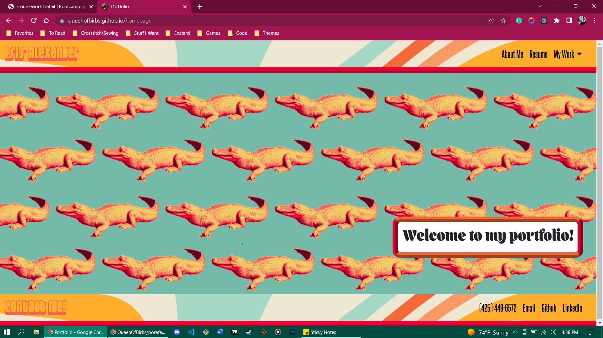

# Portfolio V3

## Description 

Here is a link to the deployed application on Github:

https://queenofbirbs.github.io/portfolio-v3/

I was originally was going for a retro theme but my brother dared me to use the alligator background and I kinda fell in love with it. Definitely a reflection of my personality and love for tackier items.
<br>
<br>
I'm no pro yet so there may be some hiccups here and there; mostly with the background not loading when the page opening but shows up if you visit another page and then come back? I'm working on it and will hopefully have a fix for it soon!

[](https://opensource.org/licenses/MIT)

## Table of Contents
- [Installation](#installation)
- [Usage](#usage)
- [Contributing](#contributing)
- [License](#license)
- [Questions](#questions)

## Installation

To run this application locally make sure to copy the files and create a React app; then ```run npm install``` to have all of the correct dependencies. Otherwise please follow the link in the description or above to try out the deployed version yourself!

## Usage

This is largely for personal use though feel free to look around! Uses React Bootstrap, React, CSS, HTML, and Javascript. Made in June 2022.
Here is a screenshot of the application:




## Contributing

Isis Alexander (https://github.com/QueenOfBirbs)

## License

This application is covered under MIT license. 

## Questions

You can reach us at goddess.isis.alexander@gmail.com if you have any questions!

